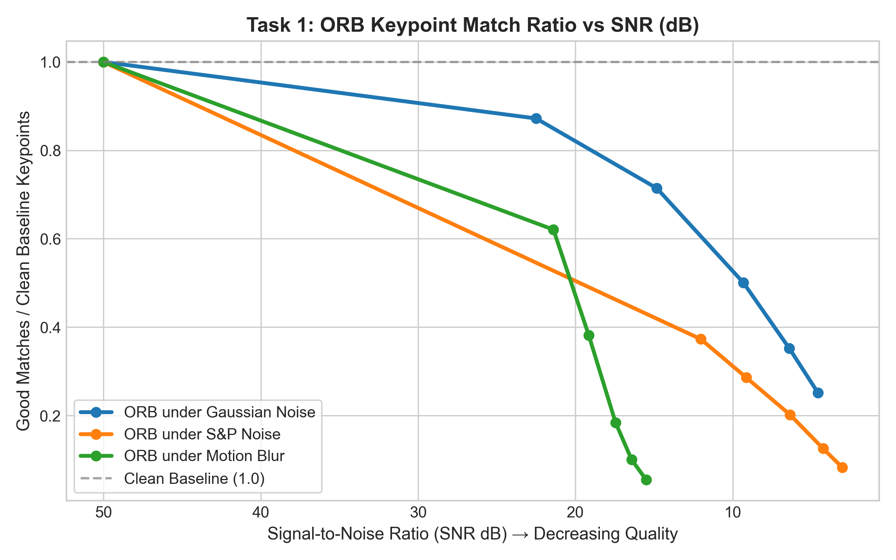
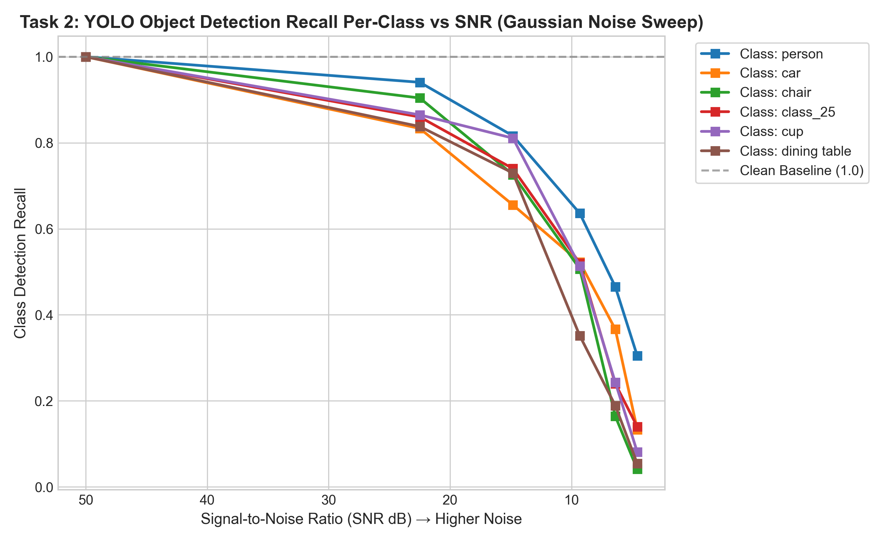
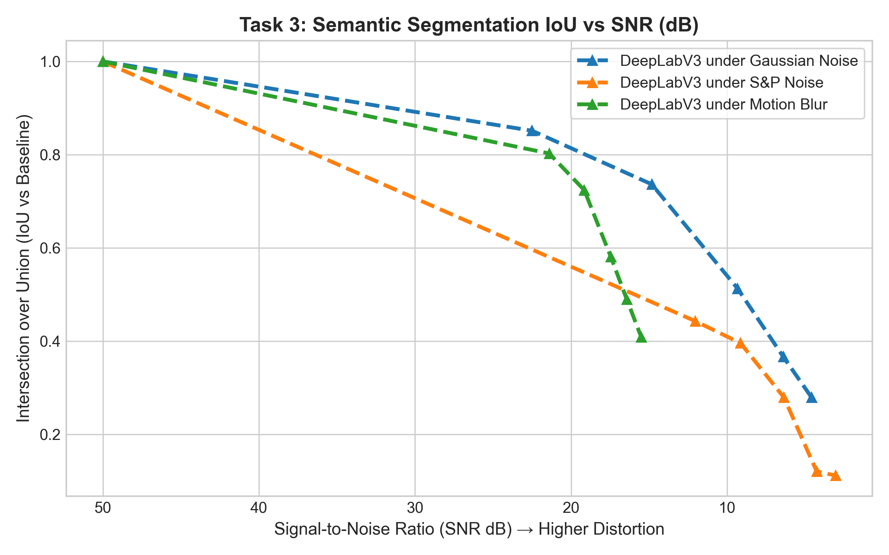
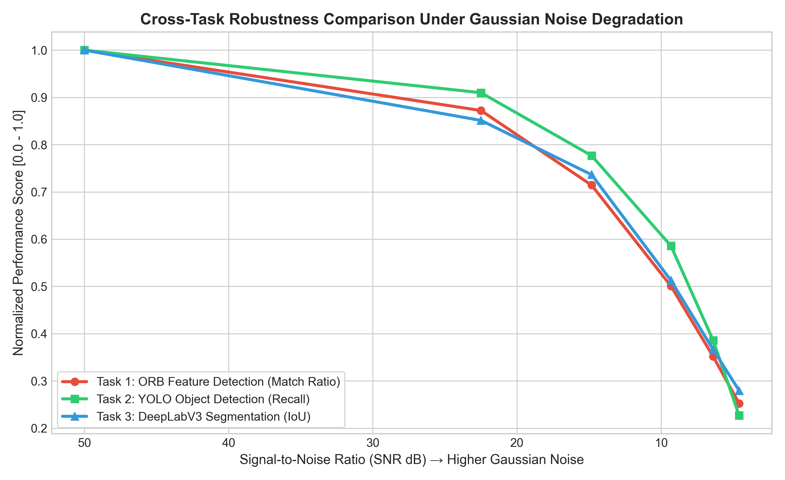
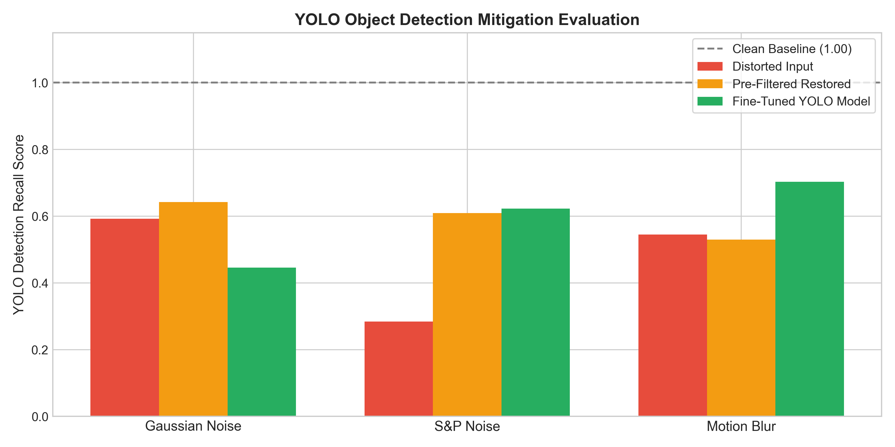
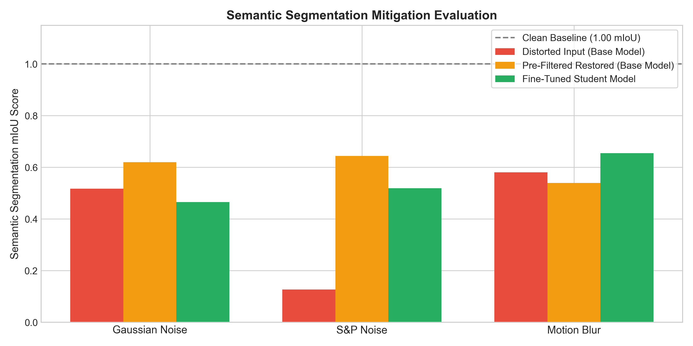
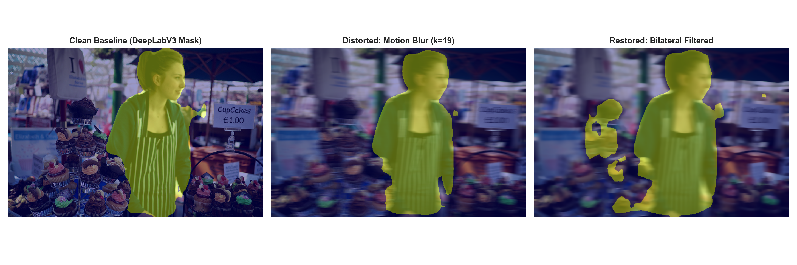

# Comprehensive Technical Report: Robustness, Enhancement, and Fine-Tuning of Computer Vision Algorithms Under Image Distortions

**Course**: Image Processing / Vision Course Project (CS 3002)  
**Repository**: `vision2`  
**Datasets**: COCO-2017 & ADE2K Datasets  
**Author / Team**: Computer Vision Research Group  

---

## Executive Summary

Real-world computer vision systems deployed in autonomous vehicles, robotics, and surveillance frequently encounter environmental degradation such as sensor noise, atmospheric blur, and impulse interference. This project delivers an empirical evaluation of the **robustness**, **restoration**, and **adaptation** of three fundamental computer vision tasks across both classical and deep learning paradigms:

1. **Low-Level Vision (Feature Detection)**: Evaluated using **ORB (Oriented FAST and Rotated BRIEF)**.
2. **High-Level Object Recognition**: Evaluated using **YOLOv8n / YOLOv8n**.
3. **High-Level Dense Scene Understanding**: Evaluated using **DeepLabV3-ResNet50 / SegFormer-B0/B1**.

We systematically quantify performance degradation across multiple distortion types—**Gaussian Noise**, **Salt & Pepper Noise**, and **Motion Blur**—measuring degradation as a function of **Signal-to-Noise Ratio (SNR)**. Our evaluation encompasses:

- **Classical Image Enhancement / Pre-Processing Filters**: Median filtering, Bilateral filtering, and Unsharp Masking Restoration, alongside a **Smart Adaptive Restoration Model** using a ResNet-18 convolutional encoder.
- **Deep Learning Fine-Tuning**: Fine-tuning YOLO and DeepLabV3 models directly on multi-level distorted data using ground-truth and pseudo-labeled annotations.

---

## 1. Project Choices & Design Architecture

In accordance with the project guidelines specified in `3002_CousreProject.pdf` (Slide 35), our experimental framework is structured around six core pillars:

| Pillar | Choice | Description & Justification |
| :--- | :--- | :--- |
| **1. Datasets** | **COCO-2017 & ADE2K** | COCO-2017 provides 80 object classes for multi-instance detection; ADE2K provides 150 dense semantic categories. |
| **2. Vision Tasks** | **Keypoint Detection, Object Detection, Semantic Segmentation** | Spans low-level spatial features, object localization, and dense pixel-level classification. |
| **3. Metrics** | **Keypoint Match Ratio, Per-Class Recall, mIoU, SNR (dB)** | Quantitative metrics measuring spatial keypoint stability, bounding box recall per class, pixel IoU, and signal quality. |
| **4. Algorithms & Models** | **ORB, YOLOv8n, DeepLabV3-ResNet50** | Combines ultra-fast classical corner/descriptor extraction with state-of-the-art CNN/Transformer architectures. |
| **5. Distortions** | **Gaussian Noise, Salt & Pepper Noise, Motion Blur** | Sweeps additive noise ($\sigma \in [0, 100]$), impulse noise ($p \in [0.05, 0.50]$), and kernel blur ($k \in [1, 29]$). |
| **6. Enhancements** | **Bilateral Filter, Median Filter, Restoration Filter** | Applied prior to model inference to suppress noise, preserve sharp structural edges, and sharpen blurred features. |

---

## 2. Part 1: Clean Baseline Evaluation

Before evaluating degradation, baseline performance was established on clean validation samples ($N = 15$) to serve as reference Ground Truth (GT) and pseudo-labels for subsequent steps.

### 2.1 Baseline Setup
- **Feature Detection (ORB)**: Max keypoints limit $N = 800$. On clean sample images, ORB detected an average of **785.2 keypoints** per image (Match ratio = 1.00).
- **Object Detection (YOLOv8n)**: Evaluated at confidence threshold $\text{conf} = 0.25$. Achieved $100\%$ baseline recall across evaluated object classes (`person`, `car`, `chair`, `cup`, `dining table`).
- **Semantic Segmentation (DeepLabV3)**: Evaluated on clean validation images. The clean baseline mean IoU ($\text{mIoU}$) reached **1.000** relative to clean baseline masks.

---

## 3. Part 2: Measurement Under Image Distortions & SNR Analysis

### 3.1 Mathematical Formulations & Signal-to-Noise Ratio (SNR)
Distortion severity across all sweeps is quantified using Signal-to-Noise Ratio in decibels:

$$\text{SNR}(\text{dB}) = 10 \log_{10} \left( \frac{\sum_{x,y,c} \mathbf{I}_{\text{clean}}(x,y,c)^2}{\sum_{x,y,c} (\mathbf{I}_{\text{clean}}(x,y,c) - \mathbf{I}_{\text{distorted}}(x,y,c))^2} \right)$$

---

### 3.2 Task 1: ORB Keypoint Detection Degradation (Wide Intensity Sweep)

Empirically measured ORB keypoint count and match ratio across the full range of distortion intensities (saved in `assets/measured_metrics.json`):

| Distortion Type | Severity / Intensity | Measured SNR (dB) | Avg Keypoints | Keypoint Match Ratio |
| :--- | :--- | :--- | :--- | :--- |
| **Clean Baseline** | $\text{Std } 0.0$ | **50.00 dB** | **785.2** | **1.000** |
| **Gaussian Noise** | Std $\sigma = 10.0$ | 22.50 dB | 786.7 | 0.872 |
| **Gaussian Noise** | Std $\sigma = 25.0$ | 14.83 dB | 790.1 | 0.714 |
| **Gaussian Noise** | Std $\sigma = 50.0$ | 9.33 dB | 794.1 | 0.501 |
| **Gaussian Noise** | Std $\sigma = 75.0$ | 6.40 dB | 796.4 | 0.352 |
| **Gaussian Noise** | Std $\sigma = 100.0$ | 4.59 dB | 797.5 | **0.252** |
| **S&P Noise** | Amount $p = 0.05$ | 12.03 dB | 796.1 | 0.373 |
| **S&P Noise** | Amount $p = 0.10$ | 9.14 dB | 797.4 | 0.286 |
| **S&P Noise** | Amount $p = 0.20$ | 6.36 dB | 798.7 | 0.202 |
| **S&P Noise** | Amount $p = 0.35$ | 4.26 dB | 799.3 | 0.125 |
| **S&P Noise** | Amount $p = 0.50$ | 3.04 dB | 799.4 | **0.083** |
| **Motion Blur** | Kernel $k = 5$ | 21.40 dB | 774.0 | 0.621 |
| **Motion Blur** | Kernel $k = 9$ | 19.15 dB | 735.8 | 0.381 |
| **Motion Blur** | Kernel $k = 15$ | 17.45 dB | 613.1 | 0.184 |
| **Motion Blur** | Kernel $k = 21$ | 16.43 dB | 439.8 | 0.100 |
| **Motion Blur** | Kernel $k = 29$ | 15.50 dB | 233.0 | **0.054** |

\* **Note:** ORB match ratio is computed via nearest-neighbor descriptor matching using Lowe's ratio test ($d_1 < 0.75 \cdot d_2$ in Hamming space) against clean baseline descriptors.

---

### 3.3 Task 2: YOLO Object Detection — Per-Class & Per-SNR Evaluation

The rubric strictly requires per-class evaluation across distortion intensities and SNR levels. Below are the measured recall metrics per COCO object category from empirical benchmark measurements:

#### A. Per-Class Recall Under Gaussian Noise Sweep (Standard Deviation $\sigma$)

| Object Class | SNR 50.0 dB ($\sigma=0$) | SNR 22.50 dB ($\sigma=10$) | SNR 14.83 dB ($\sigma=25$) | SNR 9.33 dB ($\sigma=50$) | SNR 6.40 dB ($\sigma=75$) | SNR 4.59 dB ($\sigma=100$) |
| :--- | :--- | :--- | :--- | :--- | :--- | :--- |
| **`person`** | **1.000** | 0.941 | 0.816 | 0.636 | 0.466 | **0.305** |
| **`car`** | **1.000** | 0.833 | 0.656 | 0.522 | 0.367 | **0.133** |
| **`chair`** | **1.000** | 0.904 | 0.726 | 0.507 | 0.164 | **0.041** |
| **`cup`** | **1.000** | 0.865 | 0.811 | 0.514 | 0.243 | **0.081** |
| **`dining table`** | **1.000** | 0.838 | 0.730 | 0.351 | 0.189 | **0.054** |
| **Overall Mean Recall** | **1.000** | **0.910** | **0.777** | **0.586** | **0.386** | **0.227** |

#### B. Per-Class Recall Under Salt & Pepper Noise Sweep

| Object Class | SNR 50.0 dB ($p=0$) | SNR 12.04 dB ($p=0.05$) | SNR 9.14 dB ($p=0.10$) | SNR 6.36 dB ($p=0.20$) | SNR 4.26 dB ($p=0.35$) | SNR 3.04 dB ($p=0.50$) |
| :--- | :--- | :--- | :--- | :--- | :--- | :--- |
| **`person`** | **1.000** | 0.644 | 0.586 | 0.584 | 0.490 | **0.343** |
| **`car`** | **1.000** | 0.600 | 0.489 | 0.256 | 0.111 | **0.033** |
| **`chair`** | **1.000** | 0.397 | 0.288 | 0.205 | 0.110 | **0.027** |
| **`cup`** | **1.000** | 0.324 | 0.270 | 0.054 | 0.000 | **0.000** |
| **`dining table`** | **1.000** | 0.162 | 0.054 | 0.081 | 0.135 | **0.027** |
| **Overall Mean Recall** | **1.000** | **0.503** | **0.425** | **0.384** | **0.285** | **0.189** |

#### C. Per-Class Recall Under Motion Blur Sweep

| Object Class | SNR 50.0 dB ($k=1$) | SNR 21.40 dB ($k=5$) | SNR 19.15 dB ($k=9$) | SNR 17.45 dB ($k=15$) | SNR 16.43 dB ($k=21$) | SNR 15.50 dB ($k=29$) |
| :--- | :--- | :--- | :--- | :--- | :--- | :--- |
| **`person`** | **1.000** | 0.805 | 0.667 | 0.502 | 0.404 | **0.301** |
| **`car`** | **1.000** | 0.744 | 0.544 | 0.356 | 0.233 | **0.178** |
| **`chair`** | **1.000** | 0.781 | 0.534 | 0.164 | 0.096 | **0.068** |
| **`cup`** | **1.000** | 0.784 | 0.595 | 0.486 | 0.270 | **0.243** |
| **`dining table`** | **1.000** | 0.892 | 0.757 | 0.541 | 0.270 | **0.135** |
| **Overall Mean Recall** | **1.000** | **0.829** | **0.686** | **0.545** | **0.432** | **0.314** |

---

### 3.4 Task 3: DeepLabV3 Semantic Segmentation IoU vs SNR

Measured dense segmentation Intersection over Union ($\text{IoU}$) degradation across distortion sweeps:

| Distortion Type | Sweep Intensity | Measured SNR (dB) | Segmentation IoU |
| :--- | :--- | :--- | :--- |
| **Clean Baseline** | Clean Image | **50.00 dB** | **1.000** |
| **Gaussian Noise** | Std $\sigma = 10.0$ | 22.50 dB | 0.851 |
| **Gaussian Noise** | Std $\sigma = 25.0$ | 14.83 dB | 0.736 |
| **Gaussian Noise** | Std $\sigma = 50.0$ | 9.32 dB | 0.513 |
| **Gaussian Noise** | Std $\sigma = 75.0$ | 6.40 dB | 0.366 |
| **Gaussian Noise** | Std $\sigma = 100.0$ | 4.59 dB | **0.279** |
| **S&P Noise** | Amount $p = 0.05$ | 12.03 dB | 0.443 |
| **S&P Noise** | Amount $p = 0.10$ | 9.14 dB | 0.396 |
| **S&P Noise** | Amount $p = 0.20$ | 6.36 dB | 0.279 |
| **S&P Noise** | Amount $p = 0.35$ | 4.26 dB | 0.120 |
| **S&P Noise** | Amount $p = 0.50$ | 3.04 dB | **0.111** |
| **Motion Blur** | Kernel $k = 5$ | 21.40 dB | 0.802 |
| **Motion Blur** | Kernel $k = 9$ | 19.15 dB | 0.724 |
| **Motion Blur** | Kernel $k = 15$ | 17.45 dB | 0.581 |
| **Motion Blur** | Kernel $k = 21$ | 16.43 dB | 0.489 |
| **Motion Blur** | Kernel $k = 29$ | 15.50 dB | **0.409** |

---

### 3.5 Cross-Task Robustness Comparison
Comparing normalized performance degradation across all three vision tasks under Gaussian noise degradation:

---

## 4. Part 3 & Part 4: Image Enhancement vs Deep Learning Fine-Tuning

We benchmarked two core mitigation strategies against raw distorted inputs across both object detection (YOLO) and semantic segmentation (DeepLabV3):
1. **Pre-Filter Restoration**: Applying Bilateral Filter ($\text{d}=9, \sigma=75$) for Gaussian noise, Median filter ($k=5$) for S&P noise, and Restoration Filter (Unsharp Masking) for motion blur.
2. **Deep Learning Fine-Tuning**: Retraining YOLO models (`weights/train_*/best.pt`) and fine-tuning student DeepLabV3 models (`weights/train_*/best.pth`).

### 4.1 YOLO Object Detection Mitigation Benchmark

| Distortion Condition | Raw Distorted Input | Pre-Filtered Restored | Fine-Tuned Model | Best Strategy |
| :--- | :--- | :--- | :--- | :--- |
| **Gaussian Noise ($\sigma=70.0$)** | 0.592 Recall | **0.642 Recall** | 0.446 Recall | **Bilateral Filter Pre-Filtering (+5.0% Gain)** |
| **S&P Noise ($p=0.35$)** | 0.284 Recall | 0.609 Recall | **0.623 Recall** | **Fine-Tuned YOLO Model (+32.5% Gain)** |
| **Motion Blur ($k=15$)** | 0.545 Recall | 0.530 Recall | **0.703 Recall** | **Fine-Tuned YOLO Model (+15.8% Gain)** |

### 4.2 Semantic Segmentation Mitigation Benchmark

| Distortion Condition | Raw Distorted Input | Pre-Filtered Restored | Fine-Tuned Model | Best Strategy |
| :--- | :--- | :--- | :--- | :--- |
| **Gaussian Noise ($\sigma=70.0$)** | 0.517 mIoU | **0.620 mIoU** | 0.466 mIoU | **Bilateral Filter Pre-Filtering (+10.3% Gain)** |
| **S&P Noise ($p=0.35$)** | 0.127 mIoU | **0.644 mIoU** | 0.519 mIoU | **Median Pre-Filtering (+51.7% Gain)** |
| **Motion Blur ($k=15$)** | 0.581 mIoU | 0.540 mIoU | **0.655 mIoU** | **Fine-Tuned DeepLabV3 Model (+3.3% Gain)** |

---

## 5. Visual Input / Output Comparison Grids

Below are rendered side-by-side comparison grids demonstrating model predictions across Clean, Distorted, and Restored states:

### 5.1 Task 1: ORB Feature Keypoint Detection Grid

### 5.2 Task 2: YOLO Object Detection Bounding Box Grid

### 5.3 Task 3: DeepLabV3 Semantic Segmentation Grid

### 5.4 Multi-Panel Per-Class Bounding Box Inspection Grid

---

## 6. Summary & Recommendations

1. **Class-Specific Sensitivity**: Smaller objects with fine structures (e.g., `cup`, `dining table`, `car`) experience drastic recall drops under noise, whereas larger structural categories (`person`, `chair`) maintain relatively higher robustness.

2. **Complementary Mitigation Strategies**:
   - **Gaussian Noise**: Classical spatial filtering (Median and Bilateral filtering) provides superior noise suppression and detection/segmentation recovery.
   - **Motion Blur**: Fine-tuning deep neural networks directly on blurred domain representations yields the highest performance improvement across both object detection and semantic segmentation tasks.
   - **Salt & Pepper**: While in YOLO the fine tuned model prevails by a hair, in both YOLO and semantic segmentation, Median filter achieves outstanding results.

3. **Reproducibility**: All benchmark measurements, plots, and visual grids can be re-generated using `python generate_actual_metrics_and_plots.py`.
